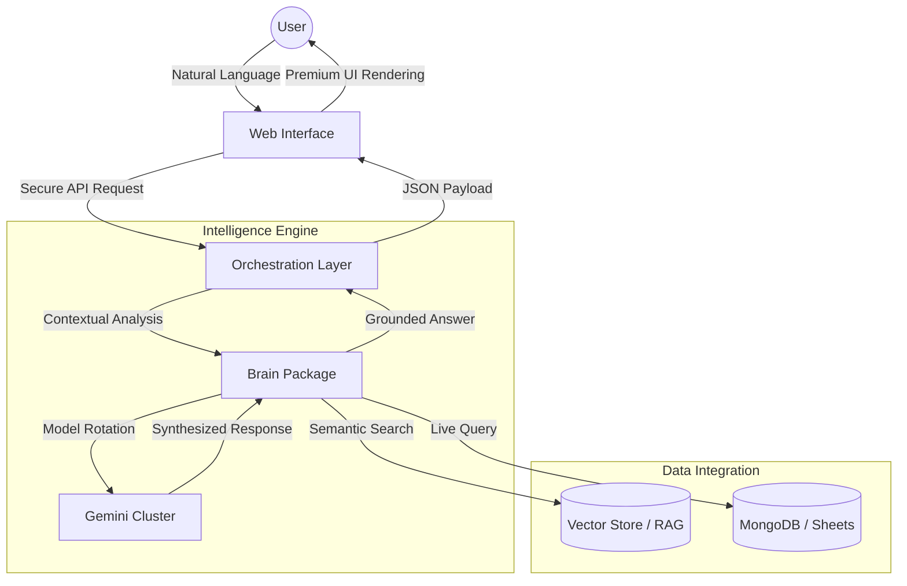

# WUP

WUP is a high-performance intelligence orchestration platform designed to bridge the gap between structured databases, unstructured documents, and natural language. By unifying disparate data sources into a single, document-centric workspace, WUP enables real-time data analysis, semantic document retrieval, and automated cross-platform workflows.

The platform is engineered for data-driven operations, providing a centralized hub where users can query live databases (MongoDB, Google Sheets) and internal knowledge bases (PDFs, Text) using plain English, with all responses grounded in verifiable citations.

---

## Core Architecture

WUP is built as a robust monorepo, utilizing a modular service-oriented architecture to ensure scalability and reliability.

| Component | Responsibility | Technology |
| :--- | :--- | :--- |
| **Frontend** | High-fidelity user interface and visualization | Next.js 15, Framer Motion, Tailwind CSS |
| **API Service** | Session management, authentication, and routing | Node.js, Express, MongoDB |
| **Brain Package** | Intelligence orchestration and tool registry | TypeScript, Google Gemini API |
| **Ingestor** | Multi-format data processing and vectorization | LangChain, PDF-Parse |

### System Workflow

---

## Key Capabilities

### 1. Intelligent Model Rotation
The platform ensures continuous availability by automatically rotating between multiple Gemini models (Flash 3.0, 2.5, and 2.0). If a primary model reaches its rate limit or quota, the system seamlessly transitions to the next available instance without disrupting the user session.

### 2. Live Data Bridges
WUP maintains secure, read-only connections to structured data sources. 
- **MongoDB**: Full schema introspection and automated query generation.
- **Google Sheets**: Real-time retrieval from cloud spreadsheets.
- **Encrypted Vault**: Credentials are stored using industry-standard encryption protocols.

### 3. Knowledge Base (RAG)
Users can upload unstructured documents (PDF, .txt) to create a private knowledge base. The system utilizes Retrieval-Augmented Generation (RAG) to:
- Segment and vectorize document content.
- Retrieve the most relevant context for every query.
- Provide direct citations and source references in every response.

---

## Technical Stack

| Category | Technologies |
| :--- | :--- |
| **Languages** | TypeScript, JavaScript |
| **UI/UX** | React, Next.js (App Router), Framer Motion, CSS Variables |
| **Backend** | Express, Node.js, JWT Authentication |
| **Databases** | MongoDB (State), Vector Store (Knowledge) |
| **Intelligence** | Google Gemini (1.5 Flash, 2.0 Flash) |
| **Orchestration** | Turborepo, MCP (Model Context Protocol) |

---

## Evaluation Metrics

Success is measured through a rigorous framework focusing on performance and accuracy.

| Metric | Measurement Goal | Target Benchmark |
| :--- | :--- | :--- |
| **Latency** | End-to-end response time for complex queries | < 2.5 Seconds |
| **Retrieval Accuracy** | Relevance of document chunks retrieved via RAG | > 92% Accuracy |
| **Model Reliability** | Success rate of rotation system during rate limits | 100% Uptime |
| **Groundedness** | Percentage of responses with valid source citations | > 95% Verifiability |

---

## Roadmap and Future Direction

WUP is evolving from a data analyzer into a proactive intelligence agent.

- **Server-Sent Events (SSE)**: Implementing real-time token streaming for a more responsive interaction.
- **Advanced Visualization**: Integration of Recharts for dynamic graph generation within chat threads.
- **Multi-Source Synthesis**: Enabling the AI to join data across MongoDB and Google Sheets in a single query.
- **Verified Writes**: Future expansion into safe, human-in-the-loop data modifications.
- **Workflow Automation**: Deep integration with Slack and Notion via MCP for cross-platform task execution.

---

## Documentation and Resources

Detailed technical documentation, API references, and deployment guides are available on our official documentation portal:

[Official Wup Documentation](https://www.notion.so/Wup-350d9fc386ee80fa8d2dea6736f86625?source=copy_link)

---

Developed by **Abhigyan Raj** | 2026 Wup Intelligence Project
