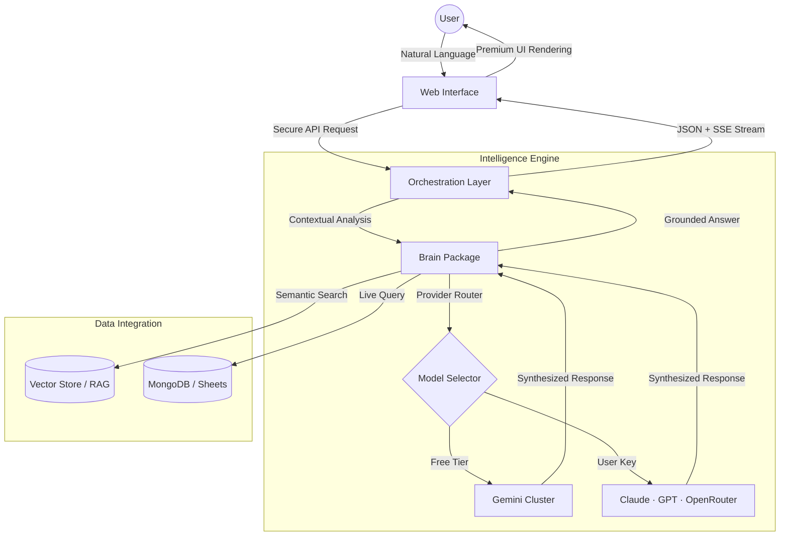

# WUP

WUP is a high-performance intelligence orchestration platform designed to bridge the gap between structured databases, unstructured documents, and natural language. By unifying disparate data sources into a single, document-centric workspace, WUP enables real-time data analysis, semantic document retrieval, and automated cross-platform workflows.

The platform is engineered for data-driven operations, providing a centralized hub where users can query live databases (MongoDB, Google Sheets) and internal knowledge bases (PDFs, Text) using plain English, with all responses grounded in verifiable citations.

---

## Core Architecture

WUP is built as a robust monorepo, utilizing a modular service-oriented architecture to ensure scalability and reliability.

| Component | Responsibility | Technology |
| :--- | :--- | :--- |
| **Frontend** | High-fidelity user interface and visualization | Next.js 16, Framer Motion, Tailwind CSS |
| **API Service** | Session management, authentication, and routing | Node.js, Express, MongoDB |
| **Brain Package** | Intelligence orchestration and multi-provider routing | TypeScript, Gemini · Claude · GPT · OpenRouter |
| **Ingestor** | Multi-format data processing and vectorization | LangChain, PDF-Parse |

### System Workflow

---

## Key Capabilities

### 1. Multi-Provider Intelligence Routing
WUP supports four production AI providers with automatic fallback and quota management. The orchestrator tries providers in priority order — if one fails due to rate limits or regional blocks, it seamlessly rotates to the next without interrupting the user session.

| Provider | Mode | Model Examples |
| :--- | :--- | :--- |
| **Google Gemini** | Global (free tier) | gemini-2.5-flash, gemini-2.0-flash |
| **Anthropic Claude** | User API key | claude-3-5-sonnet, claude-3-opus |
| **OpenAI GPT** | User API key | gpt-4o, gpt-4o-mini |
| **OpenRouter** | User API key | deepseek/deepseek-r1, meta-llama/llama-3.1-70b, and 100+ models |

### 2. Live Data Bridges
WUP maintains secure, read-only connections to structured data sources.
- **MongoDB**: Full schema introspection and automated query generation.
- **Google Sheets**: Real-time retrieval from cloud spreadsheets.
- **Encrypted Vault**: Credentials are stored using industry-standard encryption protocols.

### 3. Knowledge Base (RAG)
Users can upload unstructured documents (PDF, .txt) to create a private knowledge base. The system utilizes Retrieval-Augmented Generation (RAG) to:
- Segment and vectorize document content.
- Retrieve the most relevant context for every query.
- Provide direct citations and source references in every response.

---

## Cost Benchmark — Research Tasks

One of WUP's core design goals is **cost-efficient deep research**. The table below compares the approximate cost of running a typical research session (10 queries, ~2,000 tokens per turn, with document retrieval) across different provider configurations.

> Estimates based on published API pricing as of May 2026. Costs shown per research session.

| Configuration | Model | Input cost / 1M tokens | Output cost / 1M tokens | **Estimated session cost** |
| :--- | :--- | :--- | :--- | :--- |
| Claude Sonnet 3.5 (direct) | claude-3-5-sonnet-20241022 | $3.00 | $15.00 | **~$0.54** |
| ChatGPT GPT-4o (direct) | gpt-4o | $2.50 | $10.00 | **~$0.38** |
| WUP + Gemini (free tier) | gemini-2.5-flash | $0.00 | $0.00 | **$0.00** |
| WUP + OpenRouter (DeepSeek R1) | deepseek/deepseek-r1 | $0.55 | $2.19 | **~$0.07** |
| WUP + OpenRouter (Llama 3.1 70B) | meta-llama/llama-3.1-70b | $0.35 | $0.40 | **~$0.02** |

**Key insight:** A team running 100 research sessions per month pays ~$54 on Claude direct or ~$38 on GPT-4o. With WUP routing the same workload through DeepSeek R1 via OpenRouter, that drops to **~$7/month** — an **85% cost reduction** with comparable reasoning quality. On the Gemini free tier, it's **$0**.

---

## Technical Stack

| Category | Technologies |
| :--- | :--- |
| **Languages** | TypeScript, JavaScript |
| **UI/UX** | React, Next.js (App Router), Framer Motion, CSS Variables |
| **Backend** | Express, Node.js, JWT Authentication |
| **Databases** | MongoDB (State), Vector Store (Knowledge) |
| **Intelligence** | Gemini 2.5 Flash · Claude 3.5 · GPT-4o · OpenRouter (100+ models) |
| **Streaming** | Server-Sent Events (SSE) — real-time token streaming |
| **Orchestration** | Turborepo, MCP (Model Context Protocol) |

---

## Evaluation Metrics

| Metric | Measurement Goal | Target Benchmark |
| :--- | :--- | :--- |
| **Latency** | End-to-end response time for complex queries | < 2.5 Seconds |
| **Retrieval Accuracy** | Relevance of document chunks retrieved via RAG | > 92% Accuracy |
| **Model Reliability** | Success rate of rotation system during rate limits | 100% Uptime |
| **Groundedness** | Percentage of responses with valid source citations | > 95% Verifiability |
| **Cost Efficiency** | Session cost vs. direct Claude/GPT-4o | 85–100% reduction |

---

## Next Steps — Agentic Research Agent

WUP is actively evolving from a reactive Q&A interface into a **fully autonomous research agent**. The next phase focuses on giving the system the ability to plan, decompose, and execute multi-step research tasks without per-step human guidance.

### Phase 1 — Structured Reasoning (In Progress)
- **Plan-and-Execute loop**: Break a single user question into an ordered sequence of sub-tasks (search → retrieve → synthesize → cite).
- **Tool use via MCP**: Each sub-task dispatches the correct tool — RAG retrieval, live DB query, or external web search — and feeds the result back into the chain.
- **Intermediate state**: The agent maintains a scratchpad of discovered facts across turns, enabling it to cross-reference findings before producing a final answer.

### Phase 2 — Cost-Aware Model Dispatch
- **Task-to-model routing**: Simple lookups go to Gemini Flash (free). Complex multi-document synthesis is routed to DeepSeek R1 via OpenRouter at ~$0.07/session. Heavy reasoning chains only escalate to Claude or GPT-4o when strictly necessary.
- **Token budget enforcement**: The orchestrator tracks cumulative token spend per session and automatically downgrades model tier if a user-defined budget is approaching.
- **Result**: Research-grade output at a fraction of the direct API cost.

### Phase 3 — Deep Research Mode
- **Iterative web + document search**: The agent autonomously runs multiple retrieval rounds, evaluating source quality and filling knowledge gaps before writing a final report.
- **Citation graph**: Every claim in the output is traced back to a specific document chunk or database row.
- **Exportable report**: Structured Markdown / PDF output with inline citations, suitable for sharing or archiving.

### Phase 4 — Collaborative Agents
- **Sub-agent spawning**: A coordinator agent delegates parallel workstreams to specialized sub-agents (e.g. one for data analysis, one for literature review).
- **Cross-agent memory**: Findings are shared via a shared context store so sub-agents don't duplicate work.
- **Human-in-the-loop checkpoints**: The system surfaces key decision points for human approval before executing irreversible actions (e.g. writing to a database or sending a notification).

### Phase 5 — Platform Integrations
- **Slack + Notion via MCP**: Trigger research sessions from Slack, deliver results to Notion pages automatically.
- **Scheduled agents**: Run recurring research jobs (e.g. nightly competitor analysis) and diff the results against previous runs.
- **API-first**: Every agentic capability exposed as a REST endpoint so third-party tools can plug in.

---

## Documentation and Resources

Detailed technical documentation, API references, and deployment guides are available on our official documentation portal:

[Official Wup Documentation](https://www.notion.so/Wup-350d9fc386ee80fa8d2dea6736f86625?source=copy_link)

---

Developed by **Abhigyan Raj** | 2026 Wup Intelligence Project
